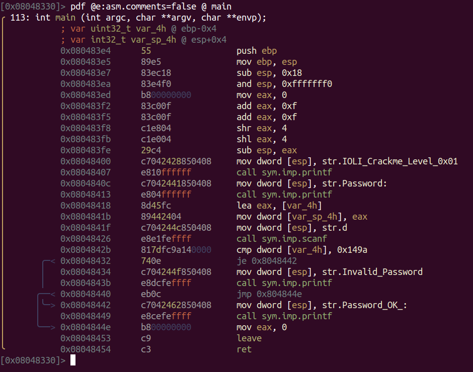
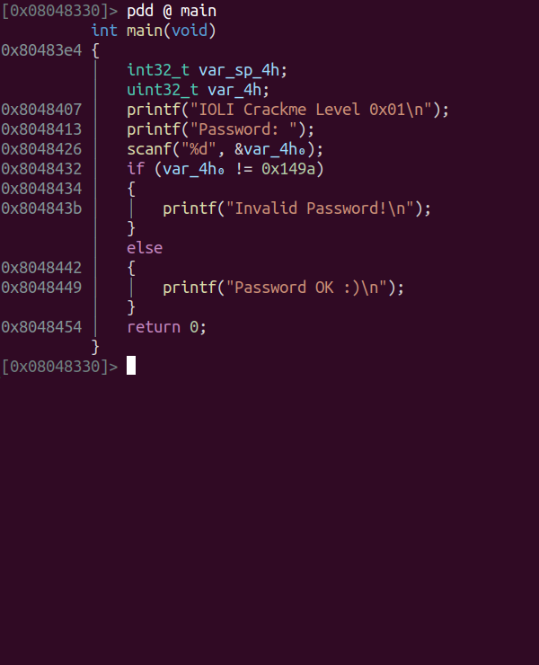
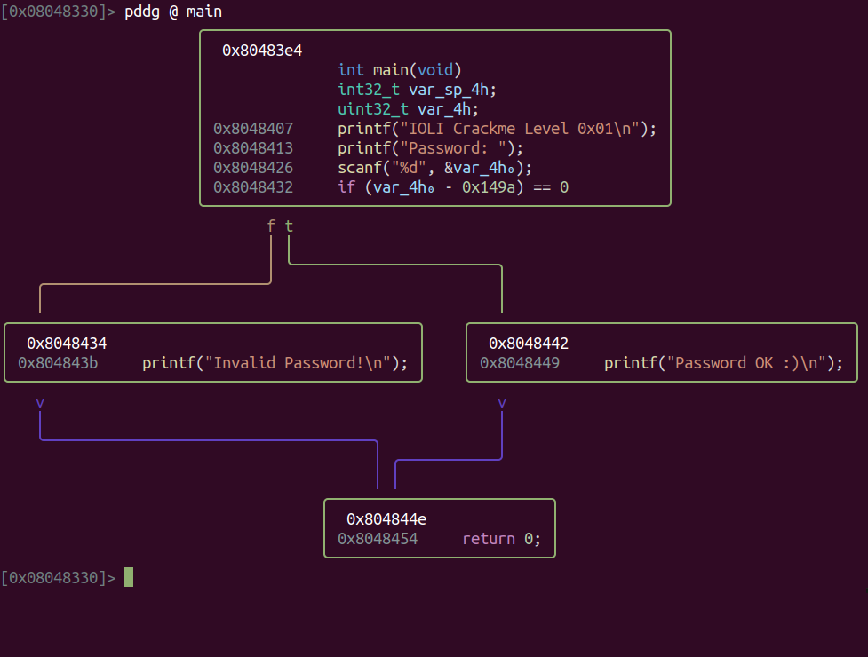

# r2dec core2

An experimental SSA-based reimplmentation of r2dec, the radare2 decompiler. Under active development.

## Installation
Installation is as simple as:

    r2pm install r2dec2

Reinstallation is recommended whenever radare2 is updated.

## Usage
In order to be able to decompile a function, it has to be analyzed first. Either analyze the requested function (`af`) or the whole binary (`aaa`) and run `pdd`.

    [0x08048330]> pdd @ main

## Arguments
While `pdd` produces a formatted output to the console, it may be followed by an optional suffix to determine an alternate output format:
* `pddg` - Decompile and show as a graph. Graph output disables control flow constructs like loops and converged conditions. All conditional branching would appear as simple `if` statements
* `pddj` - Decompile to JSON

## Evars
The following radare2 evars may be used to customize r2dec2 analysis and output:
* `pdd.cflow.converge` - Determines whether to converge (collapse) related conditions into a single statement
* `pdd.opt.noalias` - Assuming no pointer aliasing would enable additional propagations and cleaner ourpur, but might produce inacurate analysis in case there is in fact an alias
* `pdd.out.guides` - Scope guides [`0`: none, `1`: solid, `2`: dashed, `3`: dotted]
* `pdd.out.newline` - Move to a new line before opening a curly bracket
* `pdd.out.offsets` - Prefix each line with its offset (default: `true`)
* `pdd.out.tabsize` - Code indentation size (default: `4`)
* `pdd.out.theme` - Syntax highlighting coloring scheme. Possible values:
  -  `"none"` : No syntax highlighting; useful when redirecting `pdd` output to a non-tty device, or for getting cleaner `pddj` output
  - `"default"` : Use current radare2 eco colors
  - `"dark+"` : VS Code Dark+ theme

## Tips and tricks
r2dec2 relies on analysis information fetched from radare2. In case of inaccurate analysis, adding or correcting radare2 default analysis may help.

r2dec2 recognizes types that end with empty square brackets as local arrays and have them shown appropriately. That is, marking local pointers as arrays (e.g. `char[]` instead of `char*`) tells r2dec2 these are stack-allocated buffers and that it should infere their size and display them accordingly.

## Known limitations
* Limited architecture support: currently supporting only Intel architecture, both 32 and 64 bits
* SSA back translation is not implemented yet, which is why the output includes SSA indexing and Phi statements
* Limited type analysis: no expressions casting yet. Instead bitwise-and operations (`&`) may indicate changes in expressions bit size
* `switch` statements are not supported
* Unnecessary `goto` may appear in some cases

## Examples
This example uses `crackme0x01` of the `IOLI` serries.

#### Plain disassembly

#### Simple decompilation

#### Decompilation to graph

